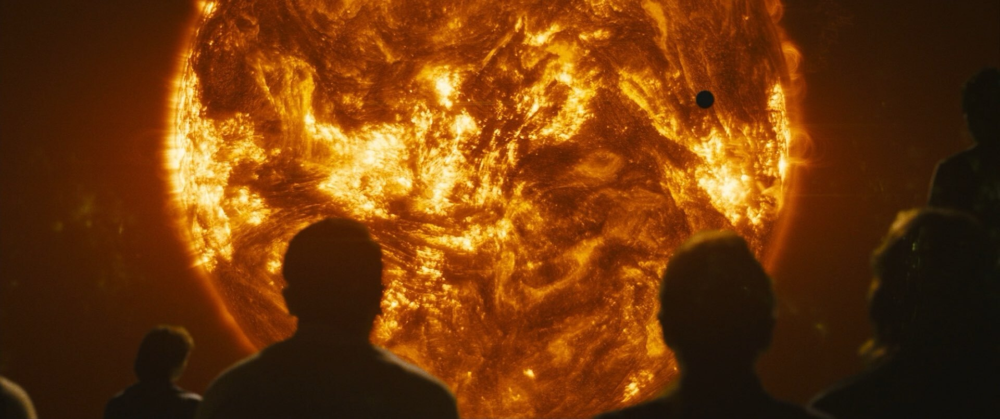

# Airi 的个人简介

我的昵称读作 **/aiɾi/** ，会取这个名字是因为它和我感兴趣的 *空气动力学（Aerodynamic，/aerodynamic/）*  一词的前缀很像，并且听起来也像是个女孩子的名字（）

 中文好像不太好音译呢，按照英文读吧（x） 

最喜欢的电影是太阳浩劫（科幻电影我几乎都看过），

最喜欢的番是可塑性记忆（Plastic Memory），

平时喜欢 [女装（是真的在很努力变得可爱那种！）](https://github.com/Cute-Dress/Dress/tree/master/A/Airi) Cosplay（自己画的妆

虽然很业余啦而且截至本文被撰写当天还没勇气去过漫展），

在学画画（但截至本文被撰写当天还一直挤不出多少时间来quq），

在学做假发造型（但截至本文被撰写当天还一直挤不出多少时间来quq），

在学如何交朋友（quq），

在学如何在日常生活中也能让人犹豫一秒钟猜我的性别（x）

除了祭蒜机意外最擅长的学科是物理学（计算流体力学分支），了解各种各样没用的小知识！

QQ：1621485327（欢迎找我玩喵，也可以来视奸我的空间喵）

Github：https://github.com/Airi-dynamic

正在某个粉色的B实习，找了一个学期的实习，为此半年都没有时间女装QuQ，找工作太难了喵QuQ

> **“这是我唯一做过的梦。这就是太阳的表面吗？每次我闭上双眼，看到的都是一样的模样。”**

