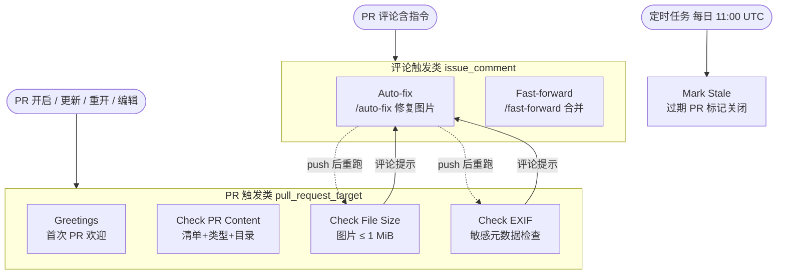
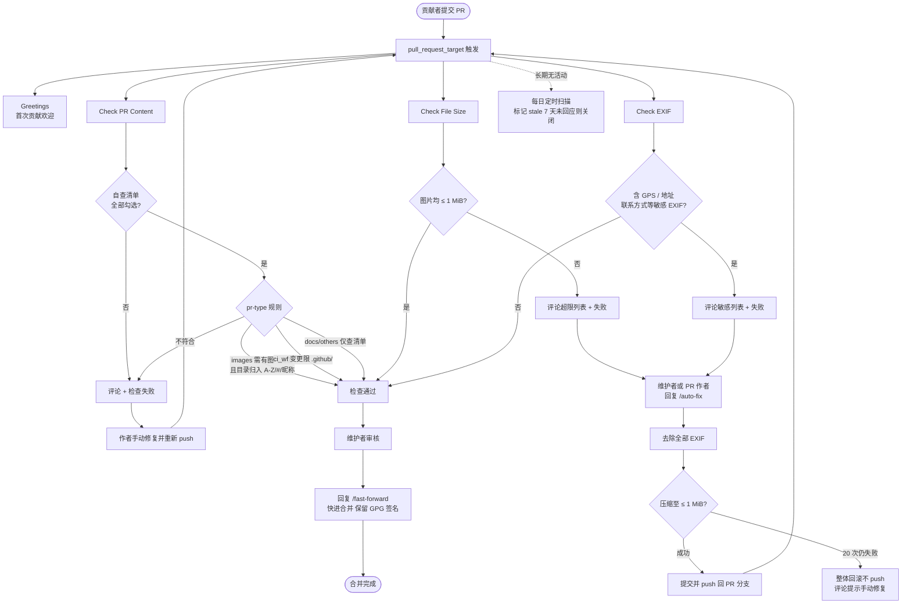

# 🌟 新手指南

欢迎来到 Dress 项目！这份指南将帮助你完成第一次 Pull Request（PR）。

---

## 📋 提交流程概览

```
Fork 仓库 → 添加你的照片 → 提交 Commit → 发起 Pull Request → 等待审核合并
```

---

## 第一步：Fork 仓库

> **Fork** = 把别人的仓库「复制」一份到你自己的 GitHub 账号下，让你可以自由修改喵，不会影响原项目喵!  

1. 打开 [Dress 仓库页面](https://github.com/Cute-Dress/Dress)
2. 点击页面右上角的 **Fork** 按钮
3. 这会在你的 GitHub 账号下创建一份仓库副本

---

## 第二步：添加你的照片

> **Commit** = 给你的修改拍一张「快照」，记录你改了什么内容，每次 Commit 都会生成一条历史记录喵!  


### 方法 A：直接在 GitHub 网页上传（最简单）

1. 进入你 Fork 后的仓库页面（`https://github.com/<你的用户名>/Dress`）
2. 根据计划使用的个人文件夹名称选择对应的首字母目录（如 `Yueosa` 进入 `Y`，数字或符号开头则进入 `#`）
3. 点击 **Add file** → **Create new file**
4. 在文件名栏输入 `你的文件夹名/README.md`（如 `Yueosa/README.md`），这会自动创建文件夹；文件夹名无需与 GitHub ID 相同
5. 在文件中随意写一些内容（如自我介绍）
6. 点击 **Commit changes**
7. 再次点击 **Add file** → **Upload files**，将你的照片上传到刚创建的文件夹中
8. 点击 **Commit changes**

---

### 方法 B：使用 Git 命令行

> **Clone** = 把远程仓库下载到本地电脑。
> **Push** = 把本地的 Commit 上传同步到远程仓库（你的 Fork）。  

```bash
# 1. 克隆你 Fork 的仓库
# 💡 由于仓库 commit 历史较多，直接 clone 可能较慢。
#    推荐使用 --depth 1 仅拉取最近一次提交，速度更快喵！
git clone --depth 1 https://github.com/<你的用户名>/Dress.git
cd Dress

# 2. 创建你的文件夹并添加照片
#    <首字母> 应与 <你的文件夹名> 的首字符对应；数字或符号开头时使用 #
mkdir -p <首字母>/<你的文件夹名>
cp /path/to/your/photos/* <首字母>/<你的文件夹名>/

# 3. 提交更改
git add .
git commit -m "Add photos for <你的文件夹名>"

# 4. 推送到你的 Fork
git push origin main
```

---

## 第三步：发起 Pull Request

> **Pull Request（PR）** = 向原仓库的维护者提出申请：「我在我的 Fork 里做了一些修改，请把它们合并到原项目里吧喵！」  

1. 回到你 Fork 的仓库页面
2. 你会看到一个提示 **"This branch is X commits ahead"**，点击 **Contribute** → **Open pull request**
3. 默认已是 **图片提交** 模板。若改的是 CI / 文档 / 其他，请用模板底部的链接切换
4. **自行勾选**模板中的全部自查项；请勿删除模板顶部的 `pr-type` 标记和清单
5. 点击 **Create pull request**

---

## 第四步：等待审核

提交照片类 PR 后，自动化会检查：

- 📋 **PR 内容检查**：自查清单是否齐全并全部勾选、是否包含图片变更、文件是否位于对应的 `A-Z/#/昵称/` 目录下
- 📏 **文件大小检查**：图片是否在 1MB 以内
- 🔒 **EXIF 信息检查**：图片是否包含高敏感元数据（主要是 **GPS 坐标**及地址类字段）

> EXIF 检查只会拦截高敏感字段（例如 GPS 坐标、IPTC/XMP 地址信息），普通摄影参数（光圈、快门等）不会导致检查失败。
> 了解详情请阅读 [EXIF.md](EXIF.md)。

检查未通过时，PR 下会留下评论说明原因。按提示修改后 **push**，或勾选清单后保存 PR 描述，检查会自动重跑。

若大小或 EXIF 未通过，PR 作者或维护者可在评论区发送 `/auto-fix` 尝试自动处理。该命令会将图片压缩到 1MB 以内，并去除**全部** EXIF（比检查更彻底）。若你不希望文件被改动，请自行处理好后再推送。

维护者人工审核通过后，你的 PR 就会被合并。恭喜你完成了一次开源贡献！🎉

---

## ⚠️ 提交前请注意

1. **压缩图片** — 确保每张图片小于 1MB。可以使用 [TinyPNG](https://tinypng.com/) 等在线工具压缩。
2. **移除高敏感 EXIF 信息** — 最重要的是删除 **GPS 坐标**，它能精确暴露你的拍摄地点。照片还可能携带地址、联系方式等信息。详见 [EXIF 字段说明](EXIF.md) 和 [贡献准备中的清理方法](CONTRIBUTING.md)。
3. **正确命名文件夹** — 使用有意义的文件夹名（无需与 GitHub ID 相同），并按其首字符放在对应的 `A-Z/#` 目录下。
4. **原创图片** — 只提交你自己的照片，不接受盗图。
5. **只修改自己的文件夹** — 请不要改动他人的文件夹或其他项目文件，避免给维护者带来不必要的麻烦。
6. **文件名避免中文和空格** — 文件名中的中文字符或空格可能导致部分系统无法正常显示或下载，请尽量使用英文字母、数字和连字符。

---

## 🔗 参考链接

- [项目说明](README.md)
- [贡献准备](CONTRIBUTING.md)
- [EXIF 说明](EXIF.md)
- [Q&A](Q&A.md)
- [已合并的 PR 参考](https://github.com/Cute-Dress/Dress/pulls?q=is%3Apr+is%3Amerged)

# 仓库Workflow流程

## 一、工作流体系总览



## 二、图片 PR 完整生命周期


## 三、工作流一览

| 工作流 | 文件 | 触发方式 | 主要行为 | 关键权限 |
| --- | --- | --- | --- | --- |
| Greetings | `greetings.yml` | `pull_request_target` | 对首次贡献者的 PR 发送中英双语欢迎评论 | `issues / pull-requests: write` |
| Check PR Content | `check_pr_content.yml` | `pull request target (opened / synchronize / reopened / edited)` | 所有类型 PR 须勾选自查清单；`images` 须有图片变更且目录符合 `A-Z/#/昵称/` 结构；`ci_wf` 变更须全部在 `.github/` 内；未识别的 `pr-type` 报错 | `contents: read, issues / pull-requests: write` |
| Check File Size | `check_file_size.yml` | `pull request target (opened / synchronize / reopened)` | 仅 `images` 类 PR：变更图片须全部 ≤ 1 MiB，超限则评论列出文件并提示 `/auto-fix`，检查失败 | `contents: read, issues / pull-requests: write` |
| Check Image EXIF Data | `check_exif.yml` | `pull request target (opened / synchronize / reopened, 同 PR 并发取消)` | 仅 `images` 类 PR：下载变更图片，用 `exiftool` 检查 GPS、地址、联系方式等高敏感 EXIF；普通摄影参数不拦截；命中则评论并提示 `/auto-fix` | `contents: read, issues / pull-requests: write` |
| Auto-fix Image Files | `auto_fix.yml` | `issue_comment`（评论以 `/auto-fix` 开头，且为维护者或 PR 作者） | 检出 PR 分支 → `exiftool` 清除全部 EXIF → 循环压缩（`jpegoptim / pngquant / optipng / ImageMagick`，最多 20 次）至 ≤ 1 MiB → push 回 PR 分支触发检查重跑；压缩失败则整体回滚不 push 并评论说明 | `contents / pull-requests / issues: write` |
| Fast-forward for PR | `fast-forward.yml` | `issue_comment / pull_request_review_comment`（评论含 `/fast-forward`） | 校验评论者 `write` 权限后执行 fast-forward 合并（避免 GitHub 合并覆盖 GPG 签名）；需 `FAST_FORWARD_TOKEN` 才能合并修改了 `.github/workflows/` 的 PR | `contents / pull-requests: write` |
| Mark Stale Issues and PRs | `stale.yml` | `schedule (cron: 00 11 * * *)` | 仅针对 PR：长期无活动先标记 `no-pr-activity` 并提醒 7 天内回应，仍无回应则关闭（issue 不处理） | `issues / pull-requests: write` |


*说明：pr-type 通过 PR 正文中的 `<!-- pr-type: xxx -->` 标签识别，取值为 `images / ci_wf / docs / others`，缺省按 `images` 处理。*