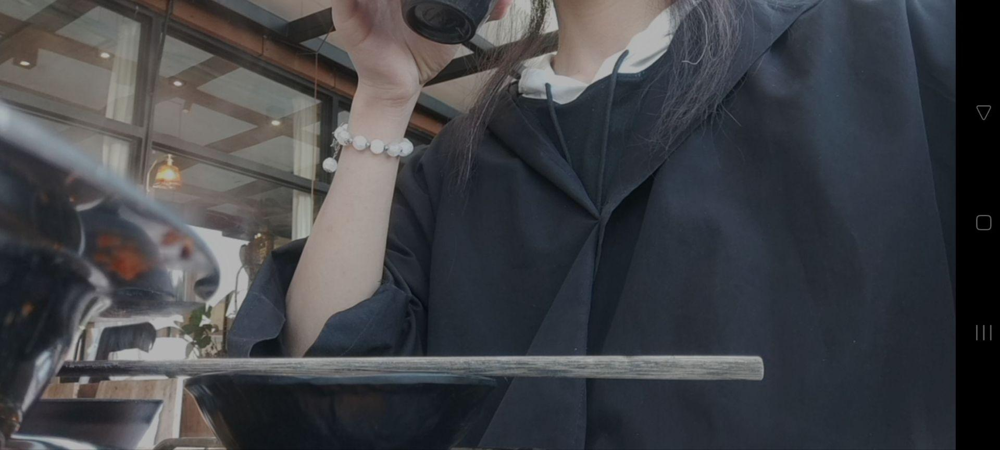

## 🌸 [YukiKoi](https://yeastar.xin)

慕名而来, 是一个学后端的小飞舞, 但也做过很多前端/GUI项目

Arch 魔怔人(?), 好奇系统底层到底在发生什么, 有严重的系统洁癖: 机器上大半软件是自己写的(包管理 TUI、壁纸守护进程、本地 agent 应用...), 配置体系也是自建的

喜欢造轮子, 这是我的学习方式——我享受理解一个东西, 然后亲手把它造出来的过程, 像小朋友拆开玩具一样. 无关乎利益, 无关乎成本, 只想活出自己的人生, 亲手创造生命里的一切

我通常完整的实现一个功能, 然后才知道它的计算机术语, 行业名词, 这是我的执念: 如果创造这个世界的人是我就好了...如果世界上所有东西都是我创造的就好了

思考自己为什么会成为这样的人, 思考自己想要什么, 然后自己学习如何创造一个东西, 解决自己的需求, 这就是我理想的人生状态

> 我的梦想是: 如果有谁观测了我创造的东西, 我希望他能从中看到一个独一无二的灵魂

---

#### 📧 联系方式

> 如果你也经常想 **"为什么?"**, 那我们大概率会聊得来

* **GitHub:** [@Yueosa](https://github.com/Yueosa)
* **Email:** yichegnxin7@gmail.com 
* **Twitter:** [@Yosa04942475621](https://x.com/Yosa04942475621)
* **QQ:** `Sakurine☆` | **1303028790**

---

#### 🖼️ 图片预览

> 个人认为不会脏眼睛的照片 (其他的纯弱智)

###### 正在吃饭的小恋

###### 第一次Cos千咲的笨蛋恋

###### 正在镜子面前臭美的小恋

###### 刚睡醒的小恋

###### 比心的小恋
