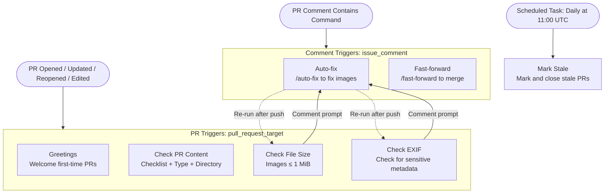
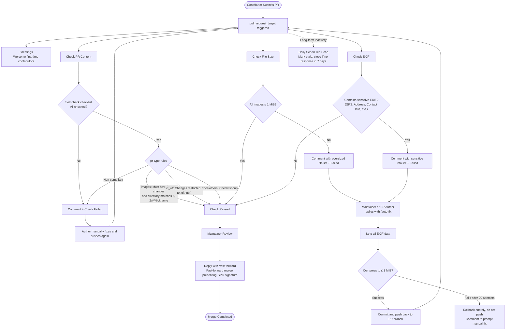

# 🌟 Beginner Guide

Welcome to the Dress project! This guide will help you complete your first Pull Request (PR).

---

## 📋 Submission Workflow Overview

```
Fork repo → Add your photos → Commit → Open Pull Request → Wait for review & merge
```

---

## Step 1: Fork the Repository
 
> **Fork** = Creating your own copy of someone else's repository under your GitHub account, so you can freely make changes without affecting the original.

1. Go to the [Dress repository page](https://github.com/Cute-Dress/Dress)
2. Click the **Fork** button at the top right
3. This creates a copy of the repository under your GitHub account

---

## Step 2: Add Your Photos
  
> **Commit** = Taking a "snapshot" of your changes, recording what you modified. Each commit creates a point in the project history.

### Method A: Upload via GitHub Web (Easiest)

1. Go to your forked repository (`https://github.com/<your-username>/Dress`)
2. Navigate to the directory matching the first character of your chosen folder name (e.g., `Y` for `Yueosa`, or `#` for a name starting with a number or symbol)
3. Click **Add file** → **Create new file**
4. Type `YourFolderName/README.md` (e.g., `Yueosa/README.md`) in the filename field. This creates the folder, which does not have to match your GitHub ID
5. Write some content (e.g., a brief introduction)
6. Click **Commit changes**
7. Click **Add file** → **Upload files** again, and upload your photos into the folder you just created
8. Click **Commit changes**

---

### Method B: Using Git CLI
 
> **Clone** = Downloading the remote repository to your local machine. 
> **Push** = Uploading your local commits back to the remote repository (your Fork).

```bash
# 1. Clone your forked repository
# 💡 The repo has a large commit history, so a full clone may be slow.
#    Consider using --depth 1 to only fetch the latest commit for a faster download!
git clone --depth 1 https://github.com/<Your username>/Dress.git
cd Dress

# 2. Create your folder and add photos
#    <FirstLetter> must match the first character of <YourFolderName>; use # for a number or symbol
mkdir -p <FirstLetter>/<YourFolderName>
cp /path/to/your/photos/* <FirstLetter>/<YourFolderName>/

# 3. Commit your changes
git add .
git commit -m "Add photos for <YourFolderName>"

# 4. Push to your fork
git push origin main
```

---

## Step 3: Open a Pull Request
  
> **Pull Request (PR)** = A request to the original repository's maintainers saying: "I've made some changes in my Fork — please merge them into the original project!"

1. Go back to your forked repository page
2. You should see a prompt saying **"This branch is X commits ahead"** — click **Contribute** → **Open pull request**
3. The default template is **Photo submission**. For CI / docs / other changes, use the links at the bottom of the template to switch
4. **Check every checklist item yourself.** Do not remove the `pr-type` tag or the checklist from the template
5. Click **Create pull request**

---

## Step 4: Wait for Review

After a photo submission PR is opened, automation will check:

- 📋 **PR content check**: Is the checklist present and fully checked? Are there image changes? Are files under the matching `A-Z/#/name/` folder?
- 📏 **File size check**: Are images under 1MB?
- 🔒 **EXIF data check**: Do images contain high-sensitivity metadata (primarily **GPS coordinates** and address fields)?

> The EXIF check only blocks high-sensitivity fields such as GPS coordinates and IPTC/XMP location data.
> Regular photography parameters (aperture, shutter speed, etc.) will not cause the check to fail.
> See [EXIF.md](EXIF.md) for details.

If a check fails, a comment on the PR will explain why. Fix the files and **push**, or tick the checklist and save the PR description — checks will re-run automatically.

If size or EXIF checks fail, the PR author or a maintainer can comment `/auto-fix` to try an automatic fix. That command compresses images to under 1MB and strips **all** EXIF (more thorough than the EXIF check). If you do not want your files modified, fix them yourself and push again.

Once a maintainer approves, your PR will be merged. Congratulations on completing an open-source contribution! 🎉

---

## ⚠️ Before You Submit

1. **Compress images** — Make sure each image is under 1MB. Use tools like [TinyPNG](https://tinypng.com/).
2. **Remove sensitive EXIF data** — The most important thing is to strip **GPS coordinates**, which can reveal your exact shooting location. Photos may also carry address and contact-info fields. See the [EXIF field guide](EXIF.md) and the [removal methods in the Contribution Preparation](CONTRIBUTING.md).
3. **Name your folder correctly** — Use a meaningful name (it does not have to match your GitHub ID) and place it under the matching `A-Z/#` directory for its first character.
4. **Original images only** — Only submit your own photos. Stolen images are not accepted.
5. **Only modify your own folder** — Do not touch other contributors' folders or any other project files.
6. **Avoid Chinese characters and spaces in filenames** — Use letters, numbers, and hyphens only to ensure compatibility across all systems.

---

## 🔗 Useful Links

- [Project README](README.md)
- [Contributing Guide](CONTRIBUTING.md)
- [EXIF Guide](EXIF.md)
- [Q&A](Q&A.md)
- [Merged PRs for reference](https://github.com/Cute-Dress/Dress/pulls?q=is%3Apr+is%3Amerged)

# Repository Workflow Process

## 1. Workflow System Overview



## 2. Complete Lifecycle of an Image PR



## 3. Workflow Summary

| Workflow | File | Trigger | Main Behavior | Key Permissions |
| --- | --- | --- | --- | --- |
| Greetings | `greetings.yml` | `pull_request_target` | Posts a bilingual (Chinese/English) welcome comment for first-time contributors | `issues / pull-requests: write` |
| Check PR Content | `check_pr_content.yml` | `pull_request_target` (opened / synchronize / reopened / edited) | All PR types must check the self-check list. `images` PRs must contain image changes and follow the `A-Z/#/Nickname/` directory structure. `ci_wf` changes must be strictly within `.github/`. Unrecognized `pr-type` triggers an error. | `contents: read, issues / pull-requests: write` |
| Check File Size | `check_file_size.yml` | `pull_request_target` (opened / synchronize / reopened) | For `images` PRs only: All changed images must be ≤ 1 MiB. If oversized, comments with the file list, prompts `/auto-fix`, and fails the check. | `contents: read, issues / pull-requests: write` |
| Check Image EXIF Data | `check_exif.yml` | `pull_request_target` (opened / synchronize / reopened, cancels concurrent runs on the same PR) | For `images` PRs only: Downloads changed images and uses `exiftool` to check for highly sensitive EXIF data (GPS, address, contact info, etc.). Standard photography parameters are not blocked. If triggered, comments with the sensitive data list and prompts `/auto-fix`. | `contents: read, issues / pull-requests: write` |
| Auto-fix Image Files | `auto_fix.yml` | `issue_comment` (Comment starts with `/auto-fix` and is made by a maintainer or PR author) | Checks out the PR branch → Strips all EXIF data using `exiftool` → Loops compression (`jpegoptim / pngquant / optipng / ImageMagick`, max 20 attempts) until ≤ 1 MiB → Pushes back to the PR branch to re-trigger checks. If compression fails, rolls back entirely without pushing and comments with an explanation. | `contents / pull-requests / issues: write` |
| Fast-forward for PR | `fast-forward.yml` | `issue_comment / pull_request_review_comment` (Comment contains `/fast-forward`) | Verifies the commenter has `write` permissions, then executes a fast-forward merge (to prevent GitHub's default merge from overwriting GPG signatures). Requires `FAST_FORWARD_TOKEN` to merge PRs that modify `.github/workflows/`. | `contents / pull-requests: write` |
| Mark Stale Issues and PRs | `stale.yml` | `schedule` (cron: 00 11 * * *) | PRs only: Marks long-inactive PRs with `no-pr-activity` and warns them to respond within 7 days. Closes the PR if there is still no response. (Does not process issues.) | `issues / pull-requests: write` |

*Note: `pr-type` is identified via the `<!-- pr-type: xxx -->` tag in the PR description. Valid values are `images / ci_wf / docs / others`. If missing, it defaults to `images`.*